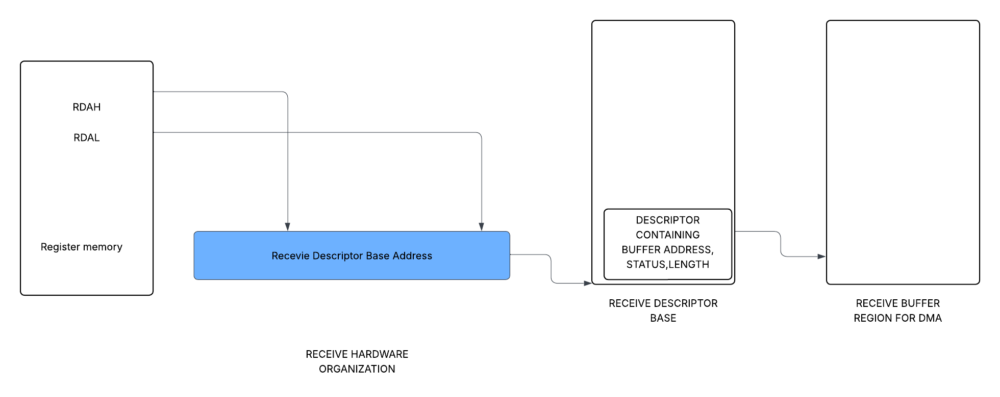

# vnetdev

This project involves two Linux modules. One module works as a network device. And the second module acts as the device driver for the network device.

## This project consists of two kernel modules
1. Virtual network Device module (nic_card): This module simulates a virtual network device with few desgin ideas from Intel 8254x Gigabit Ethernet controller specifications. This module consists of register memory to hold device status, receive descriptor, transmit descriptors information, and statistics. It also consists of two buffers to temporarily hold data for transmit and receive operations.

2. Network Driver module for the virtual network device.

   
## Architectural Summary  

   
 
The simulated network device consists of register memory and two temporary buffers to hold rx and tx packets.  
In a real-world scenario, the OS detects the device by an automatic mechanism like PCI. 
Or the device is detected using the device tree (platform device). Then the Kernel assigns a relevant driver to it.
In this case, the device is implemented as software; therefore, to mimic the real device behaviour, things are done bit
Differently here. The whole project consists of some key components mentioned below.

1. A tap interface is created, which will act as a real-world wire or physical link to our network device.

2. The network device module is initialized by creating:
   a. A character device, with all file operations implemented.
   b. The network device module also allocates memory for registers and registers a platform device with the name "vnic", and passes the
      Allocated register pointer as a memory resource.
   (Why these design steps are taken will be clarified in the next step)
   
3. The real world physical wire/link for the network device is simulated as tap daemon.
   The tap daemon obtains read/write file descriptors of tap interface, 
   AND read/write file descriptors of the character device created in network device module.
   The tap daemon mimics sending packets to the network device, by reading the data tap interface and writing it to character device.
   And transmit operation is simulated by reading data from the character device and writing it to the tap interface.
   The tap daemon does both operation in separate threads. Which polls corresponding read descriptors in fixed intervals.
   
4. The network device driver module consists of two components. The first components is the platform device driver whose probe function
   gets triggered on name based match when the module is loaded. When probe function is called it initializes network device driver, with 
   all operations. The probe function also fetches the register memory pointer passed as resource and then, Allocates memory for DMA 
   descriptor rings and the corresponding buffer. And set the register values with corresponding pointers, so that DMA rings and buffers are
   accessible in the network device module as well.

   
## Receive Descriptor ring and buffer organization

The current design consists of a  single ring for 1500 MTU support  
The following are registers involved in the receive DMA descriptor and buffer management.   

REG_RX_RDBAL: Contains the  lower 32 bits of descriptor ring base.  
REG_RX_RDBAH: Contains the  upper 32 bits of descriptor base address.  
REG_RX_RDLEN: Number of elements in the descriptor queue.  
REG_RX_HEAD: Index of head element of descriptor queue.  
REG_RX_TAIL: Index of tail element of the descriptor queue.  

To access the base of the receive descriptor ring, the contents of REG_RX_RDBAH ,REG_RX_RDBAH are combined to form the full address.  
Each descriptor can be defined as following c struct 
<code>
typedef struct{
    uint64_t buffer_address; //Physical address of DMA buffer. 
    uint16_t length; // Length of the DMA buffer.
    uint16_t packet_cheksum; //Packet checksum, currently not used.
    uint8_t status; //status bits containing information like end of packet, descriptor processed etc.
    uint8_t errors; //error bits, currently not used.
    uint16_t special; // Any other information, currently not used.
}dma_descriptor; 
</code>

   
## Transmit Descriptor ring and buffer organization

It's analogous to receive descriptor ring and buffer organization  

The following are the registers involved  

REG_TX_TBAL: Transmit Descriptor Base low.  
REG_TX_TBAH: Trasnmit Descriptor Base High.  
REG_TX_TDLEN: Number of elements in transmit descriptor ring.  
REG_TX_TDH: Transmit Descriptor Head.  
REG_TX_TDT: Transmit Descriptor Tail.  

   
## Receive Simulation:

1. The test script sends ping packets using the tap0 interface.  
2. The tap daemon keeps polling the read file descriptor for the tap0 interface.  
   And writes the obtained data using the write file descriptor of the character device,  
   In nic_card module. This simulates packet arrival on the network device.  
3. The obtained packet is written in the receive desceriptor tail element pointed buffer (DMA simulation)  
   If packet spans multiple descriptors, then 2nd bit (End of packet EOP bit) status value of descriptor of the last packet is set to 1,  
   The EOP bit of all the previous packets is 0.    
4. In nic_driver a polling function checks difference in head and tail values of receive descriptors.  
   If values are not same. The descriptors are parsed and packets are assembled from the buffer.  
5. The assembled packet is send to the protocol stack        

   
## Transmit Simulation:

1. The packet is received from the protocol stack in the nic_driver module.  
2. The packet is inserted into the transmit descriptor queue.  
   If the packet spans multiple descriptors, then 2nd bit (End of packet EOP bit) status value of descriptor of the last packet is set to 1,  
   The EOP bit of all the previous packets is 0.    
3. In nic_card module a polling function keeps tracking changes in the head and tail value.And if there is a difference, meaning queue is  
   Not empty, then packets are assembled by traversing head to tail one packet at time.   
   Once the packet is ready, the packet ready signal is enabled.  
4. The tap daemon keeps polling the write file descriptor of the character device in nic_card module.   
   Which triggers read file operation of the character device. When the packet_ready signal is active, the read function simply returns  
   the current device_tx_memory (transmit memory) contents to the tap daemon.   
5. If data is available the tap daemon writes the data back to tap interface.      

   
